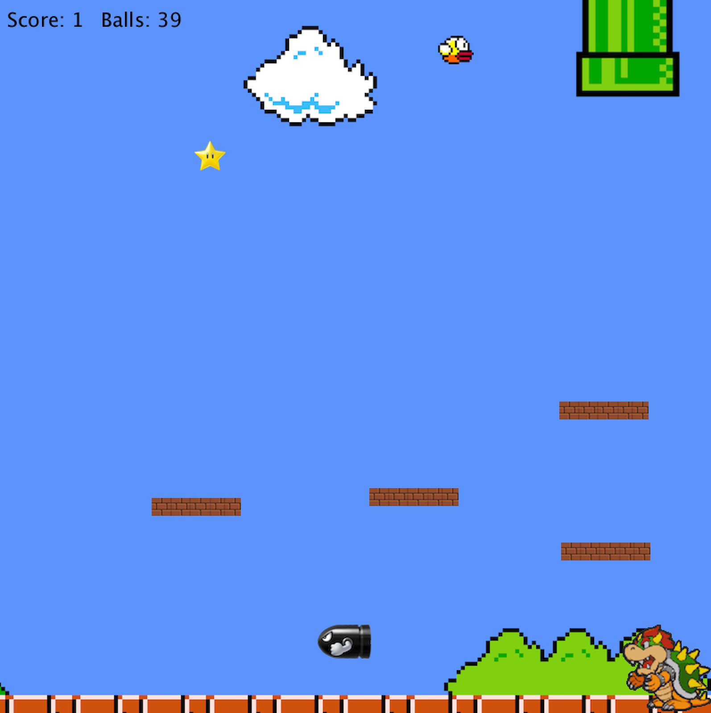

Mario & Object Physics
========

I have published a mini python game that deals with gravity, collision physics, vectors, and object classes. 
This takes advantage of Processing, a flexible software sketchbook: https://processing.org/
-Pablo Fernandez

